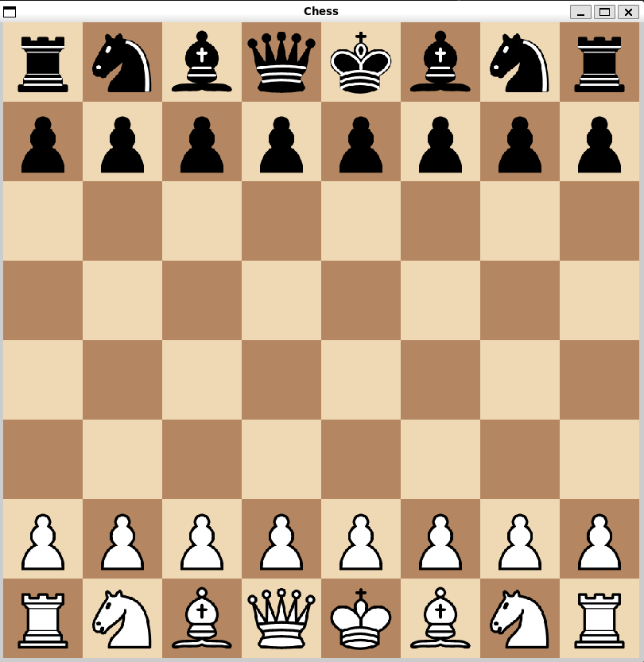

# C_Chess

Un moteur de <a href="https://www.youtube.com/@MarcQuenehen">jeu d'échec</a> développé en C, avec la librairie SDL. </br>
Avec toutes les règles implémentées (coups réguliers, roques, prise en passant, promotion) et un joueur ordinateur.



## Compilation

Prérequis : SDL2 et SDL2_image.

- Utiliser le makefile avec la commande `make` pour compiler et exécuter `c_chess`.
- Ou lancer le script `compile.sh` qui compile, exécute, puis nettoie les fichiers binaires.

```sh
./compile.sh
```

## Note de développement

Commande pratique pour retrouver les erreurs de segmentation : 
```sh
valgrind --leak-check=full ./c_chess
```
